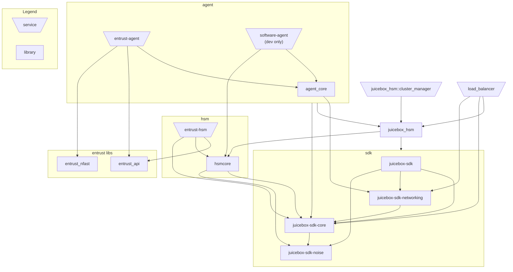

# Juicebox HSM Realm

This repo contains the source code for Juicebox's HSM-backed realms. An
HSM-backed realm can be accessed via the [Juicebox SDK] alongside other realm
implementations, such as [Juicebox software realms].

The HSM-backed realm is relatively complex to understand and operate. It's
intended for use with programmable [Hardware Security Modules]. These can
provide better privacy properties than commodity hardware, but they impose some
constraints and complications on the architecture of the HSM realm.

For development and testing purposes, you can run an HSM realm on commodity
hardware. It's much more complicated to operate than using [Juicebox software
realms] and doesn't offer any better security, so doing so is only useful for
pre-production environments.

[Juicebox SDK]: https://github.com/juicebox-systems/juicebox-sdk
[Juicebox software realms]: https://github.com/juicebox-systems/juicebox-software-realm
[Hardware Security Modules]: https://en.wikipedia.org/wiki/Hardware_security_module

## Architecture Overview

An HSM realm consists of _load balancers_, _agents_, _HSMs_, _cluster
managers_, and it relies on [Google Cloud Bigtable] and [Google Cloud Secret
Manager]. The architecture is designed to scale up to hundreds of HSMs in one
realm and tolerates the failure (by stopping) of some of those HSMs. This
section provides a brief overview of the architecture.

The architecture assumes an adversary could inspect and control all components
and the network, except that the adversary does not have visibility or control
over HSM internals. Such an adversary could cause permanent denial of service
in many ways, but it is our goal that the adversary cannot learn a
PIN-protected secret without guessing the PIN in the limited number of attempts
set by the user.

Clients communicate with _load balancers_ over HTTPS. Client requests include
an auth token and encapsulate an HSM request that is encrypted with a [Noise
protocol]. The load balancer checks the auth token (using a key from Secret
Manager) and produces a _record ID_ from its claims. The load balancer routes
the request to a particular _agent_ based on this record ID.

The _agent_ is a host-side daemon that is paired with each HSM. The system is
designed for use with PCIe-attached HSMs, where an agent runs on each physical
server that has an HSM. The agent receives the request from the load balancer
and generally forwards it to the HSM.

The HSMs are programmable and run portions of the code in this repo. Depending
on context, we use the term _HSM_ to mean either the physical device or our
code running on it. Through an initialization process, each HSM in the realm is
given a copy of secret cryptographic keys. This allows the HSM to decrypt the
client's Noise messages and process requests.

The HSMs in the realm use a consensus protocol to provide strong consistency
(linearizability) while tolerating the failure of some HSMs. The
secrets-management application requires strong consistency to prevent an
adversary from obtaining more guesses by causing a network partition, for
example.

The HSMs use an _authenticated consensus protocol_ rather than a traditional
[consensus protocol]. In the authenticated consensus protocol, the HSMs add a
layer of validating freshness and authenticity on top of a traditional
consensus protocol that runs on commodity hardware. This limits the amount of
state that the HSMs need to maintain and persist, and it lets the realm
implementation leverage existing systems. The implementation uses [Google Cloud
Bigtable] as an external storage system providing scalability and traditional
consensus (Bigtable provides atomic operations within a single row).

The HSMs are organized into replication groups, which use majority quorums and
are leader-based. Each replication group should have a small number of HSMs and
can tolerate the failure of any minority of those; for example, a group with 5
HSMs can tolerate the failure of any 2. The overall realm throughput scales up
with more groups. Requests for a group are routed to a _leader_ HSM. Other HSMs
in the group are called _witnesses_. Ideally, there should be one leader at any
given time. When a leader fails, a witness can be promoted to be a leader.

Each group maintains a _log_ for its operations. The HSMs create and process
log entries, but they only persistently store metadata about a single recent
log entry. Each group is responsible for serving up to one contiguous range of
record IDs. The records for that range are organized in a _Merkle tree_. When a
leader HSM modifies a Merkle tree, it creates a new _log entry_, which contains
the root hash of the new Merkle tree. Both the logs and the Merkle trees are
stored in Bigtable.

Each replication group has fixed membership. New replication groups can be
created dynamically, and ownership of a range of record IDs can be transferred
from one group to another with an _ownership transfer protocol_. The
replication groups themselves are the source of truth for what range of record
IDs they serve. Agents register themselves with a service discovery table
(stored in Bigtable), and load balancers query the agents to learn how to route
requests.

[Google Cloud Bigtable]: https://cloud.google.com/bigtable/docs
[Google Cloud Secret Manager]: https://cloud.google.com/secret-manager/docs
[Noise protocol]: https://noiseprotocol.org/
[consensus protocol]: https://en.wikipedia.org/wiki/Consensus_(computer_science)

## Code Structure

This repo started out with everything in a single crate and is in a confusing
state of transition as we iteratively split and reorganize the code. We are
also transitioning to naming crates using underscores. This repo also depends
on a few crates from the [Juicebox SDK] repo (which is included as a Git
submodule at the path `sdk`).

This is a diagram of the current crates, excluding tooling, showing their
local dependencies:



Entrust is an HSM vendor, and the Entrust-specific code is named accordingly.
Some of it is automatically generated from their C headers.

Note that the HSM code and its dependencies do not use the Rust standard
library. The standard library makes assumptions about the operating system that
may not be valid on all HSMs. These crates depend only on the `core` and
`alloc` crates, not `std`.

There are also various tools in this repository, not included in the diagram
above:
- `cluster_bench` runs a client benchmark against existing realm(s).
- `cluster-cli` is used to manage realms from the command-line, including
  initializing realms and transferring ownership.
- `codegen` generates bindings from Google's Protocol Buffers definitions.
- `entrust_init` is used to set up Entrust HSMs before they can participate in
  a realm.
- `src/bin/demo` is a "hello world" client.
- `src/bin/demo_runner` runs a large realm on localhost and, by default, runs
  the demo against it.
- `src/bin/hsm_bench` runs a small realm on localhost and, by default, runs a
  benchmark against it.

## Builds

System dependencies:

* [Rust](https://rustup.rs/)
* [Protocol Buffers compiler](https://github.com/protocolbuffers/protobuf#protocol-compiler-installation),
  as located and used by
  [prost-build](https://docs.rs/prost-build/latest/prost_build/#sourcing-protoc).
  This is needed for `opentelemetry-otlp` and can also be used to regenerate
  the Google Cloud API messages.  On Debian, `apt install protobuf-compiler` is
  sufficient.
* See the section on the Bigtable emulator below, which you'll also need.

Then:

* `cargo test --all` to run the unit tests
* `cargo build && cargo run --bin demo_runner -- --demo target/debug/demo` to run the rust demo aka "integration test"
* to run the swift demo:
```sh
cd sdk/swift
./ffi.sh
cd demo
swift build
cd ../../..
cargo run --bin demo_runner -- --demo sdk/swift/demo/.build/debug/demo
```

### Cross Compile

Cross compile to powerpc to run on Entrust HSM. The PowerPC CPU in the HSM doesn't support Altivec
which the rust prebuilt libraries for powerPC assume is available. So we need to build std ourselves
(or hopefully just core later on). This currently requires the nightly toolchain.

Install pre-requisites

```sh
rustup target add powerpc-unknown-linux-gnu
rustup toolchain install nightly --component rust-src
sudo apt install qemu qemu-user qemu-user-binfmt gcc-9-powerpc-linux-gnu
```

The `build-ppc.sh` and `test-ppc.sh` scripts can be used to perform the build or tests for the PPC version.


In addition to the options set in the scripts the .cargo/config.toml file is used to set the linker and CPU target.


## Local Bigtable emulator

You'll need the Bigtable emulator to run offline. You may also want the Cloud
Bigtable CLI tool, which works with the emulator and is installed the same way.
You can install these either using the hefty `gcloud` SDK or using the Go
compiler.

### Option 1: Install using the `gcloud` SDK:

Follow the [gcloud CLI installation instructions](https://cloud.google.com/sdk/docs/install).

Run:

```sh
gcloud components update beta
gcloud components install cbt
```

And start the emulator:

```sh
gcloud beta emulators bigtable start --host-port localhost:9000
```

### Option 2: Install using Go:

Run:

```sh
go install cloud.google.com/go/bigtable/cmd/emulator@latest
go install cloud.google.com/go/cbt@latest
```

And start the emulator:

```sh
emulator -host localhost -port 9000
```

### Using cbt

`cbt` is a Cloud Bigtable CLI tool. We'll make an alias for using it with the
local emulator, then create a table.

```sh
alias lbt='BIGTABLE_EMULATOR_HOST=localhost:9000 cbt -creds /dev/null -project prj -instance inst'
```

List tables:
```sh
lbt ls
```

You can create tables like this:
```sh
lbt createtable tab families=fam
```

## OpenTelemetry traces

The code sends OpenTelemetry traces over OTLP (GRPC) to `http://localhost:4317`.
You can run a Jaeger instance, for example, to receive these and view them:

Follow the [instructions](https://www.jaegertracing.io/docs/latest/getting-started/)
to get an all-in-one Docker image or executable binary.

Run:

```sh
COLLECTOR_OTLP_ENABLED=true ./jaeger-1.42.0-linux-amd64/jaeger-all-in-one --collector.otlp.grpc.host-port=:4317
```

Open <http://localhost:16686/>.

## Datadog

Traces & metrics can be sent to Datadog. Follow the
[instructions](https://docs.datadoghq.com/agent/) to install the datadog agent.
Update the `/etc/datadog-agent/datadog.yaml` file to enable the open telemetry
collector. To do this find the open telemetry section and uncomment out the
otlp_config, receiver, protocols, grpc, endpoint lines. It should look like this
when done. Or you can copy this and paste it at the top of the file.

```yaml
otlp_config:
  receiver:
    protocols:
        grpc:
          endpoint: 0.0.0.0:4317
```


## TLS Certificates

The load balancer requires connections to use TLS. The load_balancer process takes cmdline arguments
to specify where the key & cert files are.

Demo and hsm_bench will generate a self signed cert for use during these runs. This requires you to have
`openssl` in your `$PATH`.
